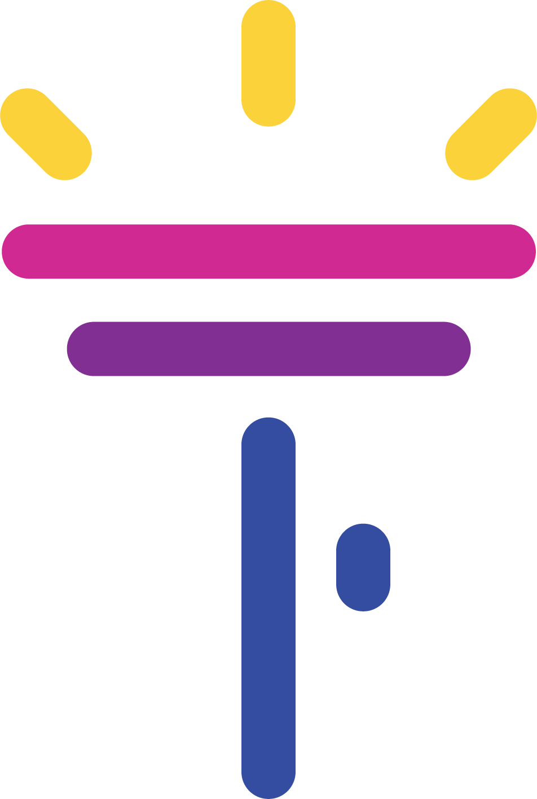

# flashlight

[](https://circleci.com/gh/facebookresearch/flashlight)
[](https://hub.docker.com/r/flml/flashlight/tags)
[](https://gitter.im/flashlight-ml/community?utm_source=badge&utm_medium=badge&utm_campaign=pr-badge&utm_content=badge)


flashlight is a fast, flexible machine learning library written entirely in C++
from the Facebook AI Research Speech team and the creators of Torch and
Deep Speech. It uses the [ArrayFire](https://github.com/arrayfire/arrayfire)
tensor library and features just-in-time compilation with modern C++.
flashlight supports both CPU (still in active development) and GPU backends for
maximum portability, and has an emphasis on efficiency and scale.

All documentation (including build/install instructions) can be found
[here](https://fl.readthedocs.io/en/latest/)

Experimental and in-progress project components are located in `flashlight/contrib`. Breaking changes may be made to APIs therein.

Contact: vineelkpratap@fb.com, awni@fb.com, jacobkahn@fb.com, qiantong@fb.com,
jcai@fb.com,  gab@fb.com, vitaliy888@fb.com, locronan@fb.com

flashlight is being very actively developed. See
[CONTRIBUTING](CONTRIBUTING.md) for more on how to help out.

# Quick Start
flashlight and relevant dependencies can be easily built and installed on Linux-based systems using the [Conan package manager](https://conan.io/). Only the flashlight
 CUDA backend is supported at this time. After [installing Conan](https://conan.io/downloads.html):
```
conan remote add bincrafters https://api.bintray.com/conan/bincrafters/public-conan  # for OpenMPI
conan remote add flashlight https://api.bintray.com/conan/flashlight/flashlight  # for ArrayFire/flashlight
conan install flashlight/0.1@conan/stable -r=flashlight
```
if no pre-built version of flashlight or ArrayFire exists on your system, you can build everything from source with:
```
conan install flashlight 0.1@conan/stable -r=flashlight --build arrayfire --build flashlight
```

See the documentation for more on how to [use Conan and flashlight with your own project](https://fl.readthedocs.io/en/latest/installation.html#building-your-project-with-flashlight).

## Acknowledgments
Some of flashlight's code is derived from
[arrayfire-ml](https://github.com/arrayfire/arrayfire-ml/).

## License
flashlight is under a BSD license. See [LICENSE](LICENSE).
