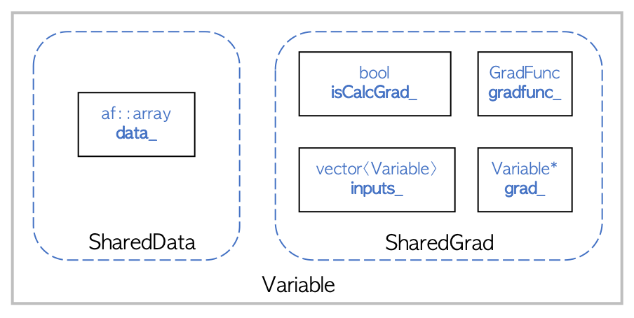

Introduction to Autograd
========================

This tutorial gives a brief overview of ``Variable`` and ``Functions``, the core components Flashlight's automatic differentiation system. We recommend reading numpy's `Tutorial <https://>`_ or ArrayFire's `Getting Started <http://arrayfire.org/docs/gettingstarted.htm>`_ section before starting this tutorial so that you are familiar with Flashlight's flavor of Tensor computation.

Variable
--------

``Variable`` is a wrapper around an Flashlight ``Tensor``. Flashlight's automatic differentiation system works with ``Variable`` directly.

::

  auto A = fl::Variable(
    fl::arange({2, 3}, 1, fl::dtype::f32)), true /* isCalcGrad */);
  // get the underlying tensor from a Variable
  std::cout << "A" << A.tensor() << std::endl;
  // A
  // [2 3 1 1]
  //    0.0000     0.0000     0.0000
  //    1.0000     1.0000     1.0000
  std::cout << A.shape() // dimension of the Variable
  // 2 3 1 1
  std::cout << A.elements() // number of elements in the Variable
  // 6
  std::cout << A.type() // type of the Variable
  // 0 <- corresponds to float32 enum

The second parameter to ``Variable``'s constructor (``isCalcGrad``) specifies whether we
want to compute the gradient for a ``Variable``.

The figure above details the high-level design of ``Variable``. ``SharedData`` and
``SharedGrad`` are shared pointer members of ``Variable``. ``SharedData`` points to the underlying Flashlight ``Tensor``, while ``SharedGrad`` stores gradients with respect to other ``Variable``. The additional members facilitate a simple differentiation API which is discussed in the following sections.

It should be noted that copying a ``Variable`` creates a shallow copy; both objects will still
refer to the same underlying Flashlight ``Tensor``.

::

  auto a = fl::Variable(fl::rand({10, 10}), false /* isCalcGrad */);
  auto b = a; // shallow copy!
  a.tensor() = fl::full({3, 2}, 2.0);
  std::cout << "b" << b.tensor() << std::endl; // The Tensor wrapped the variable 'b' is also modified
  b
  [3 2 1 1]
      2.0000     2.0000
      2.0000     2.0000
      2.0000     2.0000

Complete documentation for the ``Variable`` API can be found :ref:`here<variable>`.

Functions
---------

Similar to Flashlight Tensors, ``Variable`` can be used to perform Tensor operations directly.

::

  auto var = fl::Variable(
    fl::arange({2, 3}, 1, fl::dtype::f32), true /* isCalcGrad */);
  auto expVar = exp(var);
  std::cout << "expVar" << expVar.tensor() << std::endl;;
  // expVar
  // [2 3 1 1]
  //    1.0000     1.0000     1.0000
  //    2.7183     2.7183     2.7183

  auto A = fl::Variable(fl::full({2, 3}, 1.0), true /* isCalcGrad */);
  auto B = fl::Variable(fl::full({2, 3}, 2.0), false /* isCalcGrad */);
  auto AB = A * B;
  std::cout << "AB" << AB.tensor() << std::endl;
  // AB
  // [2 3 1 1]
  //    2.0000     2.0000     2.0000
  //    2.0000     2.0000     2.0000

A complete list of functions can be found :ref:`here<functions>`.

Automatic Differentiation
-------------------------

Given a ``Variable`` in a computation graph with some input dependencies, if at least one of its inputs requires a gradient, each preceeding ``Variable`` in the graph must keep track of its inputs, and a method by which to compute its gradient. The latter is accomplished via ``gradFunc``, a lambda function that takes the gradient of a ``Variable``'s outputs and computes the gradient with respect to its inputs.

To recursively compute the gradient of a ``Variable`` with respect to all of its inputs in the computation graph, we call the ``backward()`` function on the Variable. This iteratively computes the gradients for each ``Variable`` through the computational graph using a topological ordering by repeatedly applying the chain rule. For instance, given some ``Variable expVar`` with some input ``Variable var``, calling ``expVar.backward()`` computes the gradient of ``expVar`` with respect to ``var``.

::

  expVar.backward();
  // expVar.grad() and varGrad are Variables
  std::cout << "expVarGrad" << expVar.grad().tensor() << std::endl;
  std::cout << "varGrad" << var.grad().tensor() << std::endl;
  // expVarGrad
  // [2 3 1 1]
  //     1.0000     1.0000     1.0000
  //     1.0000     1.0000     1.0000

  // varGrad
  // [2 3 1 1]
  //     1.0000     1.0000     1.0000
  //     2.7183     2.7183     2.7183

  AB.backward();
  std::cout << "ABGrad" << AB.grad().tensor() << std::endl;
  std::cout << "AGrad" << A.grad().tensor() << std::endl;
  // ABGrad
  // [2 3 1 1]
  //     1.0000     1.0000     1.0000
  //     1.0000     1.0000     1.0000

  // AGrad
  // [2 3 1 1]
  //     2.0000     2.0000     2.0000
  //     2.0000     2.0000     2.0000

.. warning::
  Calling ``B.grad()`` will throw an exception here since ``isCalcGrad`` is set to ``false``

``TODO``: Add step-by-step execution details on an example computation graph

Various Optimizations
---------------------

ArrayFire's JIT Compiler
########################

.. note::
  This section is only applicable if using Flashlight's ArrayFire backend.

ArrayFire uses a JIT compiler to combine many small function calls into a single kernel call. Below is a simple example:

::

  auto A = fl::Variable(
      fl::rand({1000, 1000}), true); // 'A' is allocated, Total Memory: 4 MB
  auto B = 2.0 * A; // 'B' is not allocated, Total Memory : 4 MB
  auto C = 1.0 + B; // 'C' is not allocated, Total Memory :  4 MB
  auto D = log(C); // 'D' is not allocated (yet), Total Memory :  4 MB
  fl::eval(D); // only 'D' is allocated, Total Memory : 8 MB

The JIT both improves performance and reduces memory usage. For further documentation, see docs for the `ArrayFire JIT <https://arrayfire.com/performance-improvements-to-jit-in-arrayfire-v3-4/>`_.

In-Place Operations and More with ArrayFire
###########################################

.. note::
  This section is only applicable if using Flashlight's ArrayFire backend.

Since the flashlight uses ``shared_ptr`` semantics for storing its internal ArrayFire array, any
array is automatically deleted when the Variable goes out of scope.

::

  auto A = fl::Variable(fl::rand({1000, 1000}), false); // Total Memory: 4 MB
  auto B = fl::Variable(fl::rand({1000, 1000}), false); // Total Memory: 8 MB
  auto C =  fl::transpose(A); // Total Memory: 12 MB
  C = fl::matmul(C, fl::transpose(B)); // Total Memory: 12 MB. Previous 'C' goes out of scope

We have carefully optimized memory usage for forward and backward passes over the computation graph. Some autograd functions do not need to keep their input data after the forwad pass in order to compute their gradient during the backward pass (e.g. ``sum (+)``, ``transpose``). For these operations, the resulting ``Variable`` need not store its input Variables' ``SharedData``; thus, the underlying array can be freed, as it is not referenced elsewhere.

::

  // Note calcGrad is set to true here. Total Memory: 4 MB
  auto A = fl::Variable(fl::rand({1000, 1000}), true);

  // Intermediate arrays are not stored. Total Memory: 8 MB
  auto C =  fl::transpose(fl::transpose(A));

Retaining the Computation Graph
###############################

The ``backward()`` function takes an additional boolean parameter, ``retainGraph``,
which is ``false`` by default. When the argument is ``false``, each `Variable` that is not required is cleared from the computation graph while the backard pass is being computed as soon as it is no longer depended upon in the graph. This reduces peak memory usage while computing gradients. Setting ``retainGraph`` to ``true`` is not recommended unless intermediate values in the backward graph must be inspected.

::

  auto A = fl::Variable(fl::rand({1000, 1000}), true);
  auto B = fl::Variable(fl::rand({1000, 1000}), true);
  auto C = fl::matmul(A, B);
  C = fl::transpose(C);
  C = 1.0 + C;
  C.backward(false); // Note `retainGraph` is false by default

.. graphviz::

  digraph G {

   graph[rankdir=LR]
    node [fontname=Arial];

    C  [label="C", shape = "Box"]
    F  [label="F (1.0)"]
    E  [label="E"]
    D  [label="D"]
    B  [label="B", shape = "Box"]
    A  [label="A", shape = "Box"]

    E, F -> C  [label="+", color="steelblue"]
    D -> E [label=" transpose"]
    A, B -> D [label=" matmul", color="firebrick"]

    label = "Computation Graph"

  }

For example, in the above graph, the intermediate Variable ``E`` can be deleted as
soon as the gradients of ``D`` are computed.
